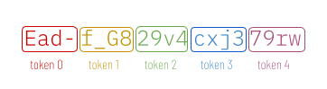
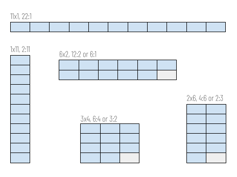
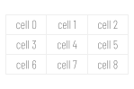
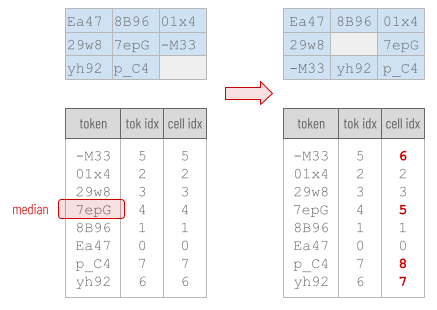
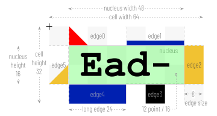
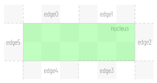
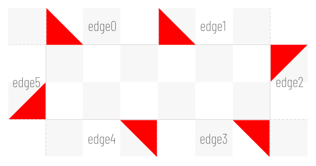

# entviz
Entviz is a simple way to visualize values with high entropy -- cryptographic keys, blockchain payment addresses, and so forth -- so a human can compare them visually. The goal is to allow an untrained adult with reasonably good vision to notice differences in two chunks of entropy with little effort.

The excellent [randomart](http://www.dirk-loss.de/sshvis/drunken_bishop.pdf) algorithm used with SSH keys has a similar goal, but accepts different constraints and uses a different approach.

## Requirements
* Work in environments that can draw bitmapped or vector graphics.
* Losslessly represent all bits of entropy.
* Uses 16 million colors (R*256, G*256, B*256). However, guarantee that entropy with even minor differences continues to have obvious visual differences in 256-color environments.
* Given the visualization, make it easy to read the entropy value out loud. 
* Be usable by people with red-green, blue-yellow, and complete color blindness.
* Be trivial to implement correctly, with no significant dependencies.

## Concepts
A diagram produced by this algorithm is called an **entviz**. Entvizes can be categorized according to the dimensions of the grid into which they render: a "3x4 entviz", a "5x9 entviz", etc. The maximum expressive **capacity** of an entviz of dimensions NxM is equal to 72*N*M bits, although slightly less information may be communicated, depending on how the entropy is serialized to text.

Although two entvizes with the same capacity are theoretically equivalent from a data science point of view, they are only visually comparable by an unschooled human if they have the same width and height. It is INVALID to ask a human to compare two entvizes for equality when they have different aspect ratios or different dimensions.

## Entviz Algorithm
1. If the input entropy is binary, render it as URL-safe base64 string. If the input entropy is already a string (e.g., base58, base64, or hex), leave it as a string.

1. Split the string into tokens, such that each token represents 3 bytes (24 bits) of binary entropy -- or as close to that amount as possible on even character boundaries. For base64 and base58 strings, token length = 4. For hex, token length = 6. Call the number of tokens the **token count**. Assign to each token a **token index** between 0 and *token count* - 1, inclusive.

    

1. The complete entropy is visualized as a rectangular **grid** consisting of a certain number of **cells**. Call this number of cells the **cell count**. Each token is rendered into one cell in the grid, and if the rectangle of the grid has more cells than *token count*, one or more cells will be empty.

    Each cell touches its neighbors directly and has an aspect ratio of 2:1. Given a **target aspect ratio** for the entviz (or, if none is given, using 1:1 as the target), choose the grid layout that that produces an overall rectangle with an aspect ratio closest to the target, without being less than the target when the ratios are written as fractions.

    >Example: 256 bits of entropy is 44 base-64 characters or 11 tokens. 11 tokens can be rendered as a grid with 11 columns and 1 row (aspect ratio 22:1), 6 columns and 2 rows (rounding *token count* to 12; aspect ratio 12:2), 4 columns and 3 rows (8:3), 3 columns and 4 rows (6:4), 2 columns and 6 rows (4:6), or 1 column and 11 rows (2:11). Given a *target aspect ratio* of 1:1, the grid layout with an aspect ratio closes to 1:1 but not less than 1:1 is the one with 3 columns and 4 rows, aspect ratio 6:4.

    

1. Moving from left to right and top to bottom -- which is how ASCII text should read if it wraps -- number the cells from 0 to N, and call the number associated with each cell its **cell index**. Assign a *cell index* to each token. Unless changed, the *cell index* of a token will equal its *token index*.

    

1. If *token count* is less than *cell count*, the grid will have blank cells. We want to use blank cells to create visual gaps in a consistent way that is more meaningful than simply putting all the blanks at the beginning or end, because this will aid comparison. Decide which cells will be empty by sorting the tokens in ASCII order (with a secondary sort by their *token index*). Identify the first token in the sorted list that contains the median value. (If the token count is even and no token values are repeated, use the first or smaller median). Call this the **median token**. Insert a blank cell at the *cell index* of the *median token* by incrementing the *cell index* of all tokens with a token index >= the token index of the median token. This essentially shifts these tokens to the right or down. If *token count* + 1 is still less than *cell count*, insert a second blank cell before the final token in the sorted list, again shifting cells that render after. If *token count* + 2 is still less than *cell count*, insert a third blank cell before the first token in the sorted list, again shifting cells that render after.

    

1. Choose a fixed-width font such as Courier, and an appropriate font size for reading. In our example, we will use 12 point.

1. Convert the point size of the font into pixels and call this value the **nucleus height**. Use the formula: pixels = (points * DPI) / 72. Most devices use 96 DPI, although other values are possible. At 96 DPI, a 12-point font = 16 pixels. This is the height of the font's tallest ascender to its lowest descender, with a line height of 1.0, which allows some extra vertical space. It means that a 12-point font will render nicely, with appropriate extra space, in a rectangle that is 16 pixels high.

1. Calculate the **cell width** by multiplying *nucleus height* by 4, and calculate **cell height** by multiplying *nucleus height* by 2. Calculate the **grid width** by multiplying *cell width* by number of columns, and **grid height** by multiplying *cell height* by number of rows. Calculate the **nucleus width** by multiplying *nucleus height* by 3. Calculate the **edge size** by dividing *nucleus height* by 2. Calculate the **long edge** by dividing **nucleus width** by 2.

    

1. Draw a white (#ffffff) rectangle with dimensions *grid width* x *grid height*, and call this the **background rect**.

1. On top of the *background rect* render each token into its appropriate cell in the background rect, using the token rendering algorithm below.

## Cell Rendering Algorithm

1. For a given token T, identify the **origin point** with coordinates *x*, *y* with the following formulas: *x* = (*T.cell index* mod *column count*) * *cell width*; *y* = int(*T.cell index* / *column count*).

1. If the token represents less than 24 bits of entropy, extend the bits of the token by repeating low-order bits until a full 24 bits is used. Call the 24-bit value associated with the token its **quant**.

1. Convert the *quant* into an RGB value the same way CSS does it -- red in the low-order byte, and so forth -- and call this RGB value the **background color**. Also convert the *background color* into the HLS color system and call the result the **HLS background color**. If the luminosity of the *HLS background color* is < 0.5, let the **foreground color** be white (#ffffff). Otherwise, let it be black (#000000).

1. Draw a **nucleus rect**. Dimensions are *nucleus width* * *nucleus height*. Top left corner is at *x* + *edge size*, *y* + *edge size*. Fill color = *background color*.

1. Using the *foreground color*, write the text of the token on top of the *nucleus rectangle*, centering it vertically and horizontally.

1. Convert the *quant* into 6 4-bit numbers and call these the **edge nums**. Assign the edge numbers an **edge index**, with index 0 for bits 0-3 and index 5 for bits 20-23.

1. Divide the white region surrounding the *nucleus rectangle* into 6 **edge rects** -- two above the nucleus, two below, and one on either side. The 4 corners of the *background rect* will not be included in any *edge rect*. The *edge rects* above and below the nucleus will have a width of *long edge* (=*nucleus width* / 2) and a height of *edge size*. The *edge rects* on either side will have a width of *edge size* and a height of *nucleus height*. Beginning with the top left *edge rect*, and moving clockwise, assign an **edge index** to each *edge rect**.

    

1. For each *edge num*, use the 2 low-order bits to select a color from the following array: [#ff0000, #000000, #f1c232, #0020b0ff]. Call this the **edge color**.

1. For each *edge num*, use the 2 high-order bits to select a shape from the following array: [triangle, square, bar, rect]. Call this the **edge shape**.

1. Inside the logical region belonging to each *edge rect*, render the *edge num* that has the same *edge index*, using the edge rendering algorithm below.

## Edge rendering algorithm
1. For all edge rendering, use *edge color* as a fill color.

1. If *edge shape* is rect, draw the *edge rect*, using the *edge color* as the fill color.

1. If *edge shape* is bar, draw a rect that touches the *nucleus rect* along its long edge, where the other dimension of the rect = *edge size* / 4.

1. If *edge shape* is square, draw a square, where width and height are both equal to *edge size*, touching the *nucleus rect* and centered within the longer dimension of the edge rect.

1. If *edge shape* is triangle, draw a right triangle where the dimensions of the legs of the triangle are both equal to *edge size*, one leg of the triangle runs parallel to the *nucleus rect*, and the other extends at a 90-degree angle from the nucleus to the outside of the *background rect*. For edges 0 and 1, use a triangle that is shaped like a capital L, with a hypotenuse running from the top of the L to its rightmost edge, and place the L flush against the left and bottom of the *edge rect*. For edge 2, rotate the triangle clockwise 90 degrees, placing the vertex of the L in the top left corner of the *edge rect*. For edges 3 and 4, rotate the L 180 degrees, placing the vertex of the L in the top right corner of the *edge rect*. For edge 5, rotate the L 270 degrees, placing the vertex of the L in the bottom right corner.

    
