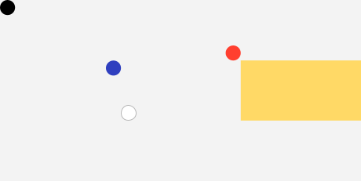

# entviz
Entviz is a simple way to visualize values with high entropy &mdash; cryptographic keys and signatures, UUIDs, blockchain payment addresses, and so forth &mdash; so a human can compare them visually. The goal is to allow an untrained adult with reasonably good vision to easily decide whether two chunks of entropy are the same or different.

Compare [entmotif](https://dhh1128.github.io/entmotif), which turns entropy into music. The excellent [randomart](http://www.dirk-loss.de/sshvis/drunken_bishop.pdf) algorithm used with SSH keys is also related; it has a similar goal to entviz, but accepts different constraints and uses a different approach.

## Requirements
* Work in environments that can draw bitmapped or vector graphics.
* Losslessly represent all bits of entropy.
* Make it easy to read the entropy value out loud without the reader losing track of where they are. 
* Support efficient partial comparisons (spot-checking).
* Uses 16 million colors (R*256, G*256, B*256). However, guarantee that entropy with even minor differences continues to have obvious visual differences in 256-color environments and in 256 shades of gray.
* Be usable by people with red-green, blue-yellow, and complete color blindness.
* Be trivial to implement correctly, with no significant dependencies.

## Nonrequirements
* Make it easy to remember all the details in a visualization. (Remembering a few arbitrarily chosen features of an entviz should be easy, but remembering all its details is unrealistic. The more appropriate goal is easy comparison to a saved copy.)
* Work in pure text environments. (Few pure text environments exist; even linux shells can save a file for viewing in a browser. Use randomart or invent a variation on this algorithm instead.)

## Concepts
A diagram produced by this algorithm is called an **entviz**. Entvizes can be categorized according to the dimensions of the grid into which they render: a "3x4 entviz", a "5x9 entviz", etc. The maximum expressive **capacity** of an entviz of dimensions NxM is equal to 24 * N * M bits, although slightly less information may be communicated, depending on how the entropy is serialized to text.

## Guarantees
Each entviz conveys its entropy fully and independently, in a first visual channel, as text. If the text in an entviz is read aloud, *taking into account case-sensitivity*, all information is transferred. Text is tokenized into cells for efficient and reliable reading, and the cells are organized into a grid.

Each entviz also conveys its entropy fully and independently, in a second visual channel, via the shapes and colors in the edges of its cells. Shapes in edges are carefully chosen to visually distinct from one another even when they are quite small and pixelated. Shapes in edges sometimes connect to each other to make larger patterns. This allows some valid gestalt judgments and decreases the arbitrary noise that makes QR codes unmemorable for humans.

The colors used with edges are selected so their differences are detectable to someone who has difficulty perceiving colors, and also so they remain quite distinct when rendered in print in grayscale.

Each entviz conveys its entropy fully and independently, in a third visual channel, via the color that provides the background for the text in each cell. However, fine gradations in the colors of the nucleus may not be perceptible to the human eye, and these gradations will disappear if less than 16 million colors are displayable. Therefore, the colors in the nucleus are a partially redundant hint; they will never be misleading, but they should not be a primary comparison method.

Zero or more cells in an entviz may be blank. The positioning of blank cells derives from the entropy. An entviz also contains small *quartile* marks on four cells. Blank cells and quartile marks are easily checked by viewers, and act as a sort of visual CRC. They surface differences that may be otherwise hidden in the middle of long strings and at the end of individual tokens.

## Thoughts About Comparing

*Note: when reading entviz text aloud, the convention is to precede each capital letter with the one-syllable prefix "cap", to read the hyphen character - as "dash", and to read the underscore character as "under". This minimizes the number of syllables while eliminating all ambiguity.*

* display counts of each shape and each color
* allow toggling off each channel, each color, each shape, CRC
* spotcheck by reading a row or column or by having a column / row slider
* render with a legend for rows and columns

## Entviz Algorithm
1. Normalize the input.
    * Remove all whitespace.
    * If the entropy is known to be a UUID, either in binary or text form, render it as a pure hex string, without braces or hyphens, and convert the string to lower case.
    * If the input entropy is a string that is not a UUID (e.g., base58, base64, or hex), strip off any prefixes that are not typically compared (e.g., remove "0x" as a prefix for hex). Also, if the particular type of string is known to be case-insensitive, convert the string to lower case.
    * If the input entropy is an arbitrary bag of bits, render it as URL-safe base64 string.

1. Split the string into tokens, such that each token represents 3 bytes (24 bits) of binary entropy &mdash; or as close to that amount as possible on even character boundaries. For base64 and base58 strings, token length = 4. For hex, token length = 6. Call the number of tokens the **token count**. Assign to each token a **token index** between 0 and *token count* - 1, inclusive.

    

    Also, if the token represents less than 24 bits of entropy, extend the bits of the token by repeating low-order bits until a full 24 bits is used. Call the 24-bit value associated with the token its **quant**.

1. The complete entropy is visualized as a rectangular **grid** consisting of a certain number of **cells**. Call this number of cells the **cell count**. Each token is rendered into one cell in the grid, and if the rectangle of the grid has more cells than *token count*, one or more cells will be empty.

    Each cell touches its neighbors directly and has an aspect ratio of 2:1. Given a **target aspect ratio** for the entviz (or, if none is given, using 1:1 as the target), choose the grid layout that produces an overall rectangle with an aspect ratio closest to the target, without being less than the target when the ratios are written as fractions.

    >Using more entropy than the example we've been building, just to show how this works in more complicated situations: 256 bits of entropy is 44 base-64 characters or 11 tokens. 11 tokens can be rendered as a grid with 11 columns and 1 row (aspect ratio 22:1), 6 columns and 2 rows (rounding *token count* to 12; aspect ratio 12:2), 4 columns and 3 rows (8:3), 3 columns and 4 rows (6:4), 2 columns and 6 rows (4:6), or 1 column and 11 rows (2:11). Given a *target aspect ratio* of 1:1, the grid layout with an aspect ratio closes to 1:1 but not less than 1:1 is the one with 3 columns and 4 rows, aspect ratio 6:4.

    

1. Moving from left to right and top to bottom &mdash; which is how ASCII text should read if it wraps &mdash; number the cells from 0 to N, and call the number associated with each cell its **cell index**. Assign a *cell index* to each token. Unless changed, the *cell index* of a token will equal its *token index*.

    

1. Sort the tokens in ASCII order (with a secondary sort by their *token index*, in case the same token appears in more than one place). Identify the first token in the sorted list that contains the median value. (If the token count is even, use the first token from the middle pair.) Call this the **median token**.

    In our example, the tokens sort like this:

    token value | index | sorted
    --- | --- | ---
    `Ead-` | 0 | 4  
    `k992` | 1 | 7
    `cxJ3` | 2 | 5
    `29v4` | 3 | 1
    `f_G8` | 3 | 6
    `23v9` | 5 | 0
    `BA4m` | 6 | 3 &lt;
    `79rw` | 7 | 2

    In sorted order, the 4th of our 8 tokens is BA4m. It is the *median token*.

1. Also sort the tokens by the ASCII order of their mirror image (with a secondary sort on the token index, in case the same token appears in more than one place). For example, if a token is "a4W6", its sort key would be "6W4a". If the number of tokens is not evenly divisible by 4, act as if 4 - (*token count* mod 4) blank items existed at the bottom of the list. Now divide the sorted list into 4 sections and call each section a **quartile**. Identify the first token in each quartile and call it the **first quartile token**, the **second quartile token**, and so on.

    In our example, the tokens reverse and then sort into quartiles like this:

    token value | index | reversed | sorted quart
    --- | --- | --- | ---
    `Ead-` | 0 | `-daE` | 0 &lt; 1st q
    `k992` | 1 | `299k` | 1
    `cxJ3` | 2 | `3Jxc` | 2 &lt; 2nd q
    `29v4` | 3 | `4v92` | 3
    `f_G8` | 4 | `8G_f` | 4 &lt; 3rd q
    `23v9` | 5 | `9v32` | 5
    `BA4m` | 6 | `m4AB` | 7
    `79rX` | 7 | `X497` | 6 &lt; 4th q

1. If *token count* is less than *cell count*, the grid will have blank cells. We want to use blank cells to create visual gaps in a consistent way that is more meaningful than simply putting all the blanks at the beginning or end, because this will aid comparison. Insert a blank cell at the *cell index* of the *median token* by incrementing the *cell index* of all tokens with a *token index* >= the *token index* of the *median token*. This essentially shifts these tokens to the right or down in the grid. If *token count* + 1 is still less than *cell count*, insert a second blank cell before the final token in the sorted list, again shifting cells that render after. If *token count* + 2 is still less than *cell count*, insert a third blank cell before the first token in the sorted list, again shifting cells that render after. Do not perform more than 3 shifts.

1. Choose a fixed-width font such as Courier, and an appropriate font size for reading. In our example, we will use 12 point, but the algorithm will work at any reasonable font size. The size of the font determines the scale of the entviz.

1. Convert the point size of the font into pixels and call this value the **nucleus height**. Use the formula: pixels = (points * DPI) / 72. Most devices use 96 DPI, although other values are possible. At 96 DPI, a 12-point font = 16 pixels. This is the distance between the font's tallest ascender to its lowest descender, with a line height of 1.0, which allows some extra vertical space. It means that a 12-point font will render nicely, with appropriate extra space, in a rectangle that is 16 pixels high.

1. Calculate the **cell width** by multiplying *nucleus height* by 4, and calculate **cell height** by multiplying *nucleus height* by 2. Calculate the **grid width** by multiplying *cell width* by number of columns, and **grid height** by multiplying *cell height* by number of rows. Calculate the **nucleus width** by multiplying *nucleus height* by 3. Calculate the **edge size** by dividing *nucleus height* by 2. Calculate the **edge rect length** by dividing **nucleus width** by 2.

    

1. On the canvas, allocate space for a bounding rectangle with dimensions *grid width* x *grid height*, and call this the **bounding rect** for the entviz. We will assume that the top left corner of the bounding rect is at position (0, 0) on the canvas, but that is not a requirement.

1. Let the array of **possible edge colors** be [white - `#ffffff`, gold - `#ffd966`, red - `#ffdf2f`, blue - `#2f3fbf`, black - `#000000`].

    

    Select the 2 low-order bits of the 24 bits of entropy from the *median token*. Use this 2-bit number as an index into the *possible edge colors* array to select the background color for the entviz. For example, if the 2-bit number == 1, the background color is gold. Remove the selected color from the array to generate a new array consisting of 4 colors, and call this the **edge colors** array.  

1. Let *array 0* of possible edge shapes be [triangle, hook, rect, box]:

    

    Let *array 1* of possible edge shapes be [slant, hammer, pyramid, double bars]
    

    Create a new array called the **edge shapes** array. Now iterate over the low-order 4 bits (bits 0 to 3) of the *quant* of the *second quartile token*. Call the selected bit the **selector** and the index of the bit the **bit index**. If the selector is 0, make the **selected shape array** array 0; otherwise, make it array 1. Copy the shape at *bit index* of *selected shape array* into *edge shapes*. This populates the *edge shapes* array with 4 shapes, each of which may come from either source array. 

1. Define two integers, **shape shift** and **color shift**, and set both of their values to 0.

1. Inside the *bounding rect*, render each token T into its appropriate cell in the grid, using *edge colors*, *edge shapes*, *shape shift* and *color shift*, according to the [cell rendering algorithm](#cell-rendering-algorithm) below.

1. Draw a circle with diameter = *edge size* / 2, centered vertically and horizontally, in a corner of each *quartile token*'s associated cell. For the first quartile token, place the circle in the top left corner of the cell, and use the first item in the *edge colors* array as its fill color. For the second, place the circle in the top right, using the second edge color. For the third, place the circle in the bottom right, using the third edge color. For the fourth, in the bottom left, using the fourth edge color.  

## Cell Rendering Algorithm

1. For a given token T, identify the **origin point** within the *bounding rect* with coordinates *x*, *y* with the following formulas: *x* = (*T.cell index* mod *column count*) * *cell width*; *y* = int(*T.cell index* / *column count*).

1. Convert the *quant* for T into an RGB value the same way CSS does it &mdash; red in the low-order byte, and so forth &mdash; and call this RGB value the **nucleus background color**. Also convert the *nucleus background color* into the HLS color system and call the result the **HLS nucleus background color**. If the luminosity of the *HLS nucleus background color* is < 0.5, let the **foreground color** be white (#ffffff). Otherwise, let it be black (#000000).

1. Draw a **nucleus rect**. Dimensions are *nucleus width* * *nucleus height*. Top left corner is at *x* + *edge size*, *y* + *edge size*. Fill color = *background color*.

1. Using the *foreground color*, write the text of the token on top of the *nucleus rectangle*, centering it vertically and horizontally.

1. Convert the *quant* for T into 6 4-bit numbers and call these the **edge nums**. Assign the edge numbers an **edge index**, with index 0 for bits 0-3 and continuing up to index 5 for bits 20-23.

1. Divide the region surrounding the *nucleus rectangle* into 6 **edge rects** &mdash; two above the nucleus, two below, and one on either side. The 4 corners of the cell will not be included in any *edge rect*. The *edge rects* above and below the nucleus will have a width of *edge rect length* (=*nucleus width* / 2) and a height of *edge size*. The *edge rects* on either side will have a width of *edge size* and a height of *nucleus height*. Beginning with the top left *edge rect*, and moving clockwise, assign an **edge index** to each *edge rect*.

1. For each *edge num*, select the 2 low-order bits and call this the **color base**. XOR the *color base* with the 2 low-order bits of the *color shift* and call the result the **color index**. Select a color from the *edge colors* array using the *color index*, and call it the **edge color**. Increment *color shift* by 1. If (T.*cell index* mod *column count*) == *column count* - 1, add *shape shift* to *color shift*.

1. For each *edge num*, select the 2 high-order bits and call this the **shape base**. XOR the *shape base* with the 2 low-order bits of the *shape shift* and call the result the **shape index**. Select a shape from the *edge shapes* array using the *shape index*, and call it the **edge shape**. If (T.*cell index* mod *column count*) != *column count* - 1, increment *shape shift* by 1.   

1. Inside the logical region belonging to each *edge rect*, draw the *edge shape* using the *edge color* as a fill color. All triangles are 45&deg;x45&deg;x90&deg;. Shapes are considered standard in edge 0 and edge 1. They rotate 90&deg; (and, in some cases, compress) for edge 2. They rotate 180&deg; from standard in edges 3 and 4. They rotate 270&deg; from standard (and, in some cases, compress) for edge 5. The shape diagrams above show the dimensions and orientations of each shape.